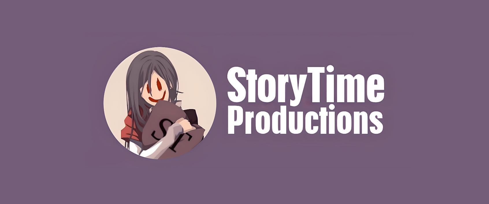

# StoryTime-Productions.github.io

<p align="center">
  
</p>

<p align="center">
  
</p>

The portfolio and blog site for StoryTime Productions - a static, no-build HTML/CSS/JS site showcasing the org's games and projects, with an interactive Three.js globe on the hero section and a lightweight JSON-driven blog.

## Live App

https://storytime-productions.github.io/

## Tech Stack

- Static HTML/CSS/JavaScript (no framework, no build step)
- [Flowbite](https://flowbite.com/) - navbar components
- [GSAP](https://gsap.com/) - About Us card animations
- [Three.js](https://threejs.org/) - interactive 3D globe on the hero section
- [EmailJS](https://www.emailjs.com/) - contact form email sending

## Getting Started

### Prerequisites

- Any static file server (e.g. VS Code Live Server) or just open `index.html` directly in a browser

### Setup

```
git clone https://github.com/StoryTime-Productions/StoryTime-Productions.github.io.git
cd StoryTime-Productions.github.io
# open index.html in a browser, or serve the directory with any static file server
```

### Scripts

None - plain static HTML/CSS/JS, no build step or package.json.

## CI/CD

None. Deployment is GitHub Pages' built-in "legacy" build (confirmed via the repo's Pages settings): pushes to `main` are served directly from the repository root with no build/Actions workflow involved.

## Contributing

No PR/issue templates or contributing guidelines exist in this repo yet.

## License

GNU General Public License v3.0 - see [LICENSE](LICENSE).
